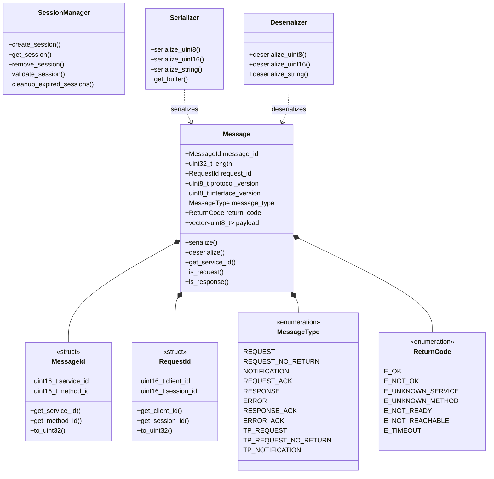
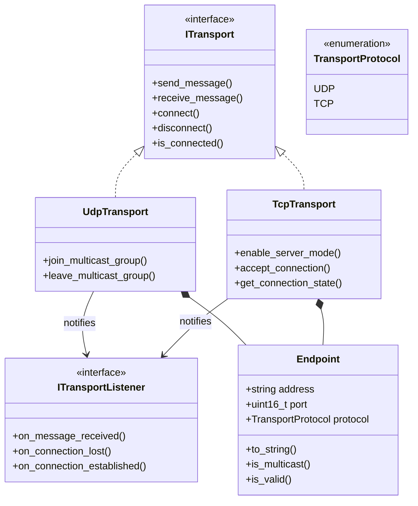

# API Reference

OpenSOME/IP is organized into self-contained modules, each with its own public header directory under `include/`.

## Modules

| Module | Headers | Description |
|--------|---------|-------------|
| [Service Discovery](sd.md) | `include/sd/` | SOME/IP-SD client, server, messages, and options |
| [RPC](rpc.md) | `include/rpc/` | Request/response client and server |
| [Transport Protocol](tp.md) | `include/tp/` | Large message segmentation and reassembly |
| [Events](events.md) | `include/events/` | Publish/subscribe event system |
| [E2E Protection](e2e.md) | `include/e2e/` | CRC, profiles, and message integrity |
| [Serialization](serialization.md) | `include/serialization/` | Data type serialization |

## Core Types

The core protocol types live in `include/someip/`:

- **`message.h`** -- `Message` class with header fields, payload, and serialization
- **`types.h`** -- `MessageId`, `RequestId`, `MessageType`, `ReturnCode`, and other protocol constants

## UDP Transport

The transport layer in `include/transport/`:

- **`udp_transport.h`** -- `UdpTransport` for sending and receiving SOME/IP messages over UDP
- **`endpoint.h`** -- `Endpoint` representing a network address and port pair

## Common Utilities

Shared utilities in `include/common/`:

- **`result.h`** -- `Result<T>` type for error handling without exceptions

## Quick Example

```cpp
#include "someip/message.h"
#include "serialization/serializer.h"
#include "transport/udp_transport.h"

using namespace someip;

// Create a request message
MessageId msg_id(0x1000, 0x0001);
Message request(msg_id, RequestId(0x1234, 0x5678));

// Add payload
Serializer ser;
ser.serialize_string("Hello SOME/IP");
request.set_payload(ser.get_buffer());

// Send over UDP
transport::UdpTransport udp(Endpoint("0.0.0.0", 30490));
udp.initialize();
udp.send_message(request, Endpoint("192.168.1.100", 30490));
```

## Integration

Link the libraries you need in CMake:

```cmake
add_subdirectory(path/to/opensomeip)

target_link_libraries(your_target
  someip-core
  someip-serialization
  someip-transport
  someip-sd          # if using Service Discovery
  someip-rpc         # if using RPC
  someip-events      # if using Events
)
```

## Core Class Diagram



## Transport Class Diagram


