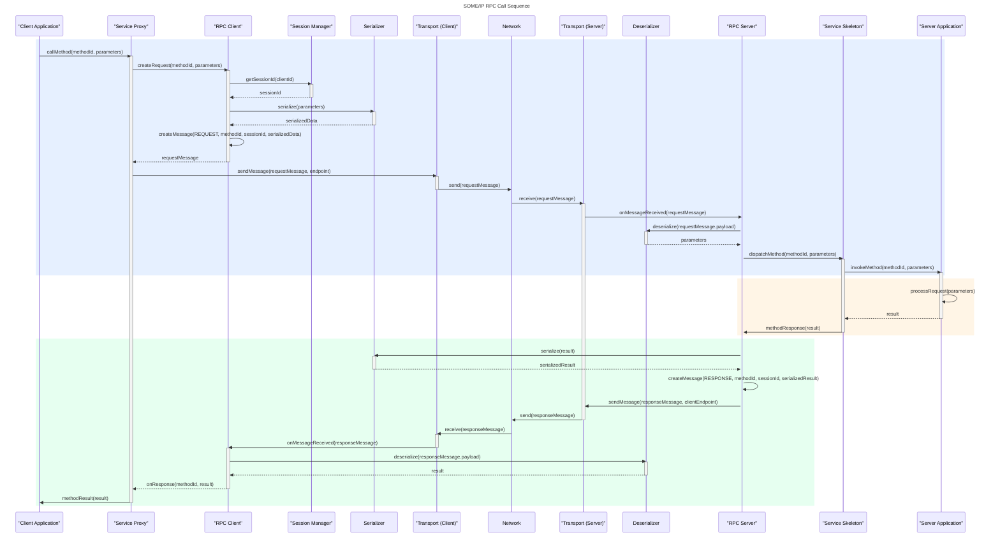

# RPC (Remote Procedure Call) Layer

The RPC layer provides high-level interfaces for making method calls between SOME/IP clients and servers. This layer handles request/response correlation, timeout management, and parameter serialization/deserialization.

## Architecture



### Components

#### RpcClient
- **Purpose**: Client-side interface for making RPC method calls
- **Features**:
  - Synchronous and asynchronous method calls
  - Automatic timeout handling
  - Request/response correlation
  - Call cancellation support
  - Statistics tracking

#### RpcServer
- **Purpose**: Server-side interface for handling RPC method calls
- **Features**:
  - Method handler registration
  - Automatic response generation
  - Error handling and return codes
  - Statistics tracking

#### RpcTypes
- **Purpose**: Common types and constants for RPC operations
- **Includes**:
  - Result codes and timeout configurations
  - Request/response structures
  - Callback function types

## Usage Examples

### Server Side

```cpp
#include <rpc/rpc_server.h>

using namespace someip::rpc;

// Create server for service ID 0x1234
RpcServer server(0x1234);

// Initialize server
server.initialize();

// Register method handler
server.register_method(0x0001, [](uint16_t client_id, uint16_t session_id,
                                 const std::vector<uint8_t>& input,
                                 std::vector<uint8_t>& output) -> RpcResult {
    // Process input parameters
    // Generate output parameters
    return RpcResult::SUCCESS;
});

// Server runs until shutdown
server.shutdown();
```

### Client Side

```cpp
#include <rpc/rpc_client.h>

using namespace someip::rpc;

// Create client with ID 0xABCD
RpcClient client(0xABCD);

// Initialize client
client.initialize();

// Synchronous call
RpcSyncResult result = client.call_method_sync(0x1234, 0x0001, parameters);

// Asynchronous call
RpcCallHandle handle = client.call_method_async(0x1234, 0x0001, parameters,
    [](const RpcResponse& response) {
        // Handle response
    });

// Cancel async call if needed
client.cancel_call(handle);

// Client shutdown
client.shutdown();
```

## Safety Considerations (non-certified)

1. **Timeout Management**: RPC calls have configurable timeouts to prevent indefinite blocking
2. **Error Handling**: Comprehensive error codes and graceful failure modes
3. **Thread Safety**: RPC interfaces are thread-safe for concurrent operations
4. **Resource Management**: Cleanup of pending calls and resources

### Deterministic Behavior

1. **Timeout Guarantees**: Calls will not block indefinitely
2. **Error Propagation**: All errors are properly reported to application
3. **State Validation**: Internal state is validated before operations

## Protocol Details

### Message Flow

```
Client                  Server
  |                       |
  |---REQUEST------------>|
  |                       |
  |<--RESPONSE------------|
  |                       |
```

### Message Types Used

- **REQUEST**: Client to server method invocation
- **RESPONSE**: Server to client method result (success)
- **ERROR**: Server to client method result (failure)

### Session Management

- Each RPC call gets a unique session ID
- Session IDs are managed by the SessionManager
- Request/response correlation uses session IDs

### Timeout Handling

- **Request Timeout**: Time allowed for request transmission
- **Response Timeout**: Time allowed for response reception
- Timeout violations result in RpcResult::TIMEOUT

## Configuration

### Timeout Configuration

```cpp
RpcTimeout timeout;
timeout.request_timeout = std::chrono::milliseconds(1000);
timeout.response_timeout = std::chrono::milliseconds(5000);
```

### Client Configuration

```cpp
RpcClient client(client_id);
// Client automatically binds to available UDP port
```

### Server Configuration

```cpp
RpcServer server(service_id);
// Server binds to default SOME/IP port (30490)
```

## Error Handling

### Client Errors

- **TIMEOUT**: Response not received within timeout period
- **NETWORK_ERROR**: Transport layer communication failure
- **SERVICE_NOT_AVAILABLE**: Server not reachable
- **INTERNAL_ERROR**: Internal client error

### Server Errors

- **METHOD_NOT_FOUND**: Requested method not registered
- **INVALID_PARAMETERS**: Malformed request parameters
- **INTERNAL_ERROR**: Server-side processing error

## Testing

Unit tests cover:
- Method registration/unregistration
- Synchronous and asynchronous calls
- Timeout behavior
- Error handling
- Statistics tracking

See `test_rpc.cpp` for comprehensive test coverage.

## Dependencies

- **someip-core**: Basic SOME/IP types and messages
- **someip-transport**: UDP transport layer
- **someip-serialization**: Parameter serialization/deserialization
