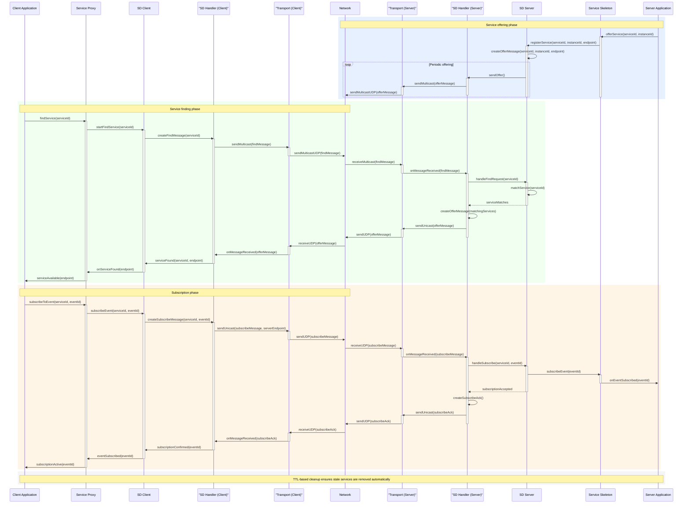

# Service Discovery (SD) Layer

The Service Discovery layer implements the SOME/IP-SD protocol, enabling dynamic service discovery in automotive networks. This layer allows services to advertise their availability and clients to find and subscribe to services automatically.

## Architecture

The diagrams below trace the main SOME/IP-SD interactions between client and server stacks across offering, discovery, and event subscription. Client-side and server-side transport and SD handlers are shown separately because each host runs its own instances.



### Components

#### SdClient
- **Purpose**: Client-side service discovery for finding and subscribing to services
- **Features**:
  - Active service finding with callbacks
  - Service availability subscriptions
  - Event group subscriptions
  - Automatic service monitoring
  - Multicast and unicast SD message handling

#### SdServer
- **Purpose**: Server-side service offering and discovery response
- **Features**:
  - Service offering with automatic re-offering
  - Find request responses
  - Event group subscription handling
  - TTL management and expiration
  - Periodic offer messages

#### SdMessage & SdEntry/SdOption
- **Purpose**: SD protocol message structures and serialization
- **Features**:
  - SOME/IP-SD message format implementation
  - Service and event group entries
  - IPv4 endpoint and multicast options
  - Big-endian serialization

#### SdTypes
- **Purpose**: Common types and configurations for SD operations
- **Includes**:
  - Service instance information
  - Event group definitions
  - SD configuration parameters
  - Result codes and subscription states

## Usage Examples

### Server Side - Offering Services

```cpp
#include <sd/sd_server.h>

using namespace someip::sd;

// Create SD server
SdServer server;

// Initialize
server.initialize();

// Offer calculator service
ServiceInstance calculator_service;
calculator_service.service_id = 0x1234;
calculator_service.instance_id = 0x0001;
calculator_service.major_version = 1;
calculator_service.ip_address = "192.168.1.100";
calculator_service.port = 30500;

server.offer_service(calculator_service, "192.168.1.100:30500");

// Server runs and automatically sends periodic offers
server.shutdown();
```

### Client Side - Finding Services

```cpp
#include <sd/sd_client.h>

using namespace someip::sd;

// Create SD client
SdClient client;

// Initialize
client.initialize();

// Find service actively
client.find_service(0x1234, [](const std::vector<ServiceInstance>& services) {
    for (const auto& service : services) {
        std::cout << "Found service at " << service.ip_address << ":" << service.port << std::endl;
    }
});

// Subscribe to service availability
client.subscribe_service(0x1234,
    [](const ServiceInstance& service) { /* service available */ },
    [](const ServiceInstance& service) { /* service unavailable */ });

// Client monitors services automatically
client.shutdown();
```

## Protocol Details

### SD Message Format

```
SOME/IP-SD Message:
+-------------------+
| SOME/IP Header    | (Service ID = 0xFFFF)
+-------------------+
| SD Header         | (Flags, Reserved)
+-------------------+
| Entries Array     | (Service/Event Group entries)
+-------------------+
| Options Array     | (Endpoint/Multicast options)
+-------------------+
```

### Entry Types

- **FIND_SERVICE (0x00)**: Client searching for services
- **OFFER_SERVICE (0x01)**: Service offering itself
- **STOP_OFFER_SERVICE (0x01, TTL=0)**: Service stopping offers
- **SUBSCRIBE_EVENTGROUP (0x06)**: Subscribe to event group
- **SUBSCRIBE_EVENTGROUP_ACK (0x07)**: Acknowledge subscription
- **SUBSCRIBE_EVENTGROUP_NACK (0x07, TTL=0)**: Reject subscription

### Option Types

- **IPV4_ENDPOINT (0x04)**: IPv4 unicast endpoint
- **IPV4_MULTICAST (0x14)**: IPv4 multicast address
- **IPV4_SD_ENDPOINT (0x24)**: IPv4 SD endpoint

### Message Flow

#### Service Offering
```
Server              Multicast Group          Client
  |                       |                       |
  |---OFFER_SERVICE------>|                       |
  |                       |---OFFER_SERVICE------>|
  |                       |                       |
  |---OFFER_SERVICE------>| (periodic)            |
  |                       |---OFFER_SERVICE------>|
```

#### Service Finding
```
Client              Multicast Group          Server
  |                       |                       |
  |---FIND_SERVICE------->|                       |
  |                       |---FIND_SERVICE------->|
  |                       |                       |
  |<--OFFER_SERVICE--------|                       |
  |                       |<--OFFER_SERVICE--------|
```

## Configuration

### Default SD Configuration

```cpp
SdConfig config;
config.multicast_address = "239.255.255.251";    // Standard SD multicast
config.multicast_port = 30490;                   // Standard SD port
config.unicast_address = "127.0.0.1";           // Local unicast
config.unicast_port = 0;                        // Auto-assign
config.initial_delay = std::chrono::milliseconds(100);
config.repetition_base = std::chrono::milliseconds(2000);
config.cyclic_offer = std::chrono::milliseconds(30000);
config.ttl = std::chrono::milliseconds(3600000); // 1 hour
```

### Timing Behavior

1. **Initial Offer**: Sent after the configured `initial_delay` (default 100 ms); set to zero for immediate sending
2. **Repetition Phase**: Offers sent with exponential backoff
3. **Cyclic Phase**: Regular offers sent every 30 seconds
4. **TTL Expiration**: Services expire after TTL seconds

## Safety Considerations (non-certified)

1. **Timeout Management**: SD operations have configurable timeouts
2. **Error Handling**: Comprehensive error codes and graceful degradation
3. **Resource Management**: Cleanup of subscriptions and timers
4. **Thread Safety**: SD interfaces are thread-safe for concurrent access

### Deterministic Behavior

1. **Timing Guarantees**: Offer timing follows strict schedules
2. **State Consistency**: Service states are consistently maintained
3. **Message Ordering**: SD messages maintain proper sequencing

## Event Groups

Event groups allow clients to subscribe to specific sets of events from services:

```cpp
// Subscribe to event group
client.subscribe_eventgroup(service_id, instance_id, eventgroup_id);

// Server handles subscription
server.handle_eventgroup_subscription(service_id, instance_id, eventgroup_id,
                                    client_address, true); // acknowledge
```

## Testing

Unit tests cover:
- SD message serialization/deserialization
- Entry and option construction
- Client/server basic functionality
- Configuration validation
- Timing behavior

See `test_sd.cpp` for comprehensive test coverage.

## Dependencies

- **someip-core**: Basic SOME/IP types and utilities
- **someip-transport**: UDP transport for multicast/unicast messaging

## Integration with RPC

The SD layer works seamlessly with the RPC layer:

1. **SD discovers services** and their endpoints
2. **RPC uses discovered endpoints** for method calls
3. **Combined usage** enables full SOME/IP client-server communication

```cpp
// Discover service via SD
client.find_service(CALCULATOR_SERVICE, [](const auto& services) {
    if (!services.empty()) {
        // Use discovered endpoint for RPC calls
        auto endpoint = services[0];
        // Make RPC calls to endpoint.ip_address:endpoint.port
    }
});
```
