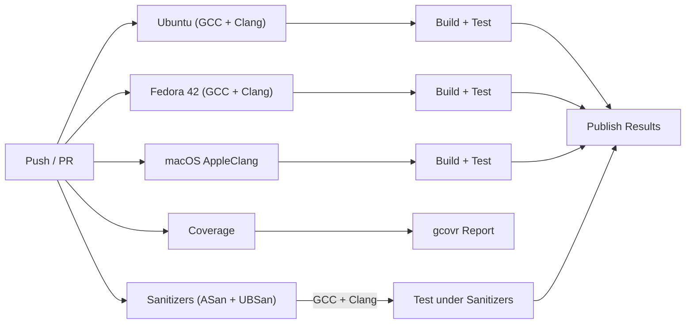

# Gateway Supported Platforms

The protocol gateways target Linux-class host systems where external protocol SDKs are available. Unlike the core `opensomeip` stack (which runs on bare-metal RTOS targets), gateways require POSIX networking and depend on userspace libraries.

## Platform Matrix

| Platform | Architecture | Compiler | CI Tested | Notes |
|----------|-------------|----------|-----------|-------|
| Ubuntu (latest) | x86_64 | GCC | :white_check_mark: | Primary CI platform |
| Ubuntu (latest) | x86_64 | Clang | :white_check_mark: | |
| Fedora 42 | x86_64 | GCC | :white_check_mark: | Container-based CI |
| Fedora 42 | x86_64 | Clang | :white_check_mark: | |
| macOS (latest) | arm64 (Apple Silicon) | AppleClang | :white_check_mark: | CI + local dev verified |

## CI Pipeline



| Job | Platform | Compilers | Purpose |
|-----|----------|-----------|---------|
| Build | Ubuntu | GCC, Clang | Build + test all gateway libraries and tests |
| Build (Fedora) | Fedora 42 | GCC, Clang | Fedora container build + test |
| macOS | macOS | AppleClang | macOS native build + test |
| Coverage | Ubuntu | GCC | Code coverage via gcovr |
| Sanitizers | Ubuntu | GCC, Clang | AddressSanitizer + UndefinedBehaviorSanitizer |

## Gateway Build Availability

Gateways gracefully degrade when their external SDK is not installed. The translator
and configuration code still compiles and tests run, but runtime gateway functionality
is unavailable until the SDK is linked.

| Gateway | External SDK | Required? | Stub Build Without SDK |
|---------|-------------|-----------|------------------------|
| common | None | — | Always builds |
| iceoryx2 | iceoryx2-cxx | Optional | :white_check_mark: |
| MQTT | PahoMqttCpp | Optional | :white_check_mark: |
| gRPC | gRPC + Protobuf | Optional | :white_check_mark: |
| ROS2 | rclcpp + std_msgs | Optional | :white_check_mark: |
| D-Bus | libsystemd | Optional | :white_check_mark: |
| Zenoh | zenohc | Required | :x: |
| DDS | CycloneDDS | Required | :x: |

!!! tip "Building with full SDK support"
    To build a gateway with full runtime functionality, install the SDK first:

    ```bash
    # Example: MQTT gateway with Paho
    sudo apt install libpaho-mqttpp-dev
    cmake -B build -DBUILD_GATEWAY_MQTT=ON
    cmake --build build
    ```

## Compiler Requirements

| Compiler | Minimum Version | C++ Standard |
|----------|----------------|--------------|
| GCC | 9.0 | C++17 |
| Clang | 10.0 | C++17 |
| AppleClang | 12.0 | C++17 |
